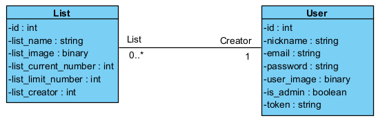
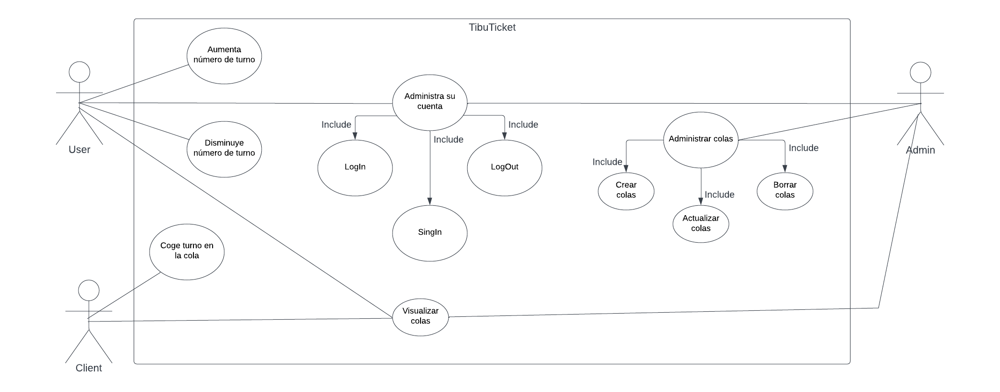

# TibuTicket 

## Table of contents:

- [Introduction](#introduction)
- [Diagrams](#diagrams)
- [Entity Relationship](#entity-relationship)
- [Relational Diagram](#relational-diagram)
- [Class Diagram](#class-diagram)
- [User Types](#user-types)
- [Admin](#admin)
- [Employee](#employee)
- [Clients/customers](#clientscustomers)
- [Interfaces](#interfaces)
- [Usability and Accesibility](#usability-and-accesibility)
- [Technological Stack](#technological-stack)
- [FronEnd](#frontend)
- [BackEnd](#backend)
- [Comparison](#comparison)
- [Installation Steps](#installation-steps)
- [BackEnd Setup](#backend-setup)
- [FrontEnd Setup](#frontend-setup)
- [Test](#test)
- [User Requirements](#user-requirements)
- [Postman](#postman)
- [Planning](#planning)
- [Conclusions](#conclusions)
- [Helpfull Links](#helpfull-links)

## Introduction:
- This is a colaboration of three people to give an  application for the supermarkets in order to make the  process of buying products more efficient. The idea was born from the necessity that many customers have when the management of tickets scanning the Qr with the phone camera. It was developed using HTML, CSS and JavaScript in the Frontend and RubyOnRails in the backend.

## Diagrams:

## Entity Relationship:
 

 

## Relational Diagram:


## Class Diagram:


## Use cases:


## User Types:

- ### Admin:
    The admin can create, edit and delete the lists and increase or decrease the number.
- ### Employee:
    The employee has access to view and increase or decrease the number of the lists.
- ### Clients/customers:
    The client only has access to take a ticket of the list he desires.
## Interfaces:
- https://www.figma.com/file/tg48KKDbrZ6F4992hykPjz/ProjectUsabi?type=design&node-id=0%3A1&mode=design&t=zH6fmTraTgpfshuf-1
- ### Mobile:
 

- ### PC:
 

## Usability and Accesibility:

#### Usability
* Large Buttons:** Large buttons are easy to see and click, making it easy for users to interact with them.  
  

**Simple and Common Interface:** A simple interface is easy to understand and navigate because the experience is repetitive.  
  

**Menu:** This menu is an efficient way to hide less important navigation options on smaller screens.  
  

**Easy Access to a Help Manual:** Providing users with easy access to a help manual that teaches them the basic uses and requirements of the application.  
  

**Error Handling with Clarity:** Displaying clear and concise error messages, guiding users on how to correct issues without causing frustration.  
  

**Form Field Validation:** Informative messages appear to guide users on the information they should input.  
  

#### Accessibility
* All images have an "Alt" Attribute.  


* Minimal text and low screen saturation.


* Color contrast: Using dark text on a light background to improve readability.


These practices have been incorporated to make the website more accessible and provide a positive experience for all users.
## Technological Stack:

- ### Backend (Ruby on Rails)

- **Ruby (Version 3.0.0+):** Dynamic, object-oriented programming language.
  
- **Ruby on Rails (Version 7.1.1):** Web development framework following the convention over configuration principle.

- **PostgreSQL (Version 1.1):** Relational database management system.

- **Puma (Version >= 5.0):** Application web server for Ruby.

- **Devise and Devise-JWT:** Gems for user authentication in Ruby on Rails.

- **Active Model Serializers and JSONAPI Serializer:** Facilitate serialization of Ruby objects into JSON API formats.

- **Rack CORS:** Middleware for Cross-Origin Resource Sharing (CORS) handling in Rails.

- **Figaro:** Gem for securely managing environment variables.

- **Bcrypt (Version ~3.1.7):** Hashing algorithm for secure password storage.

- **Bootsnap:** Gem for reducing boot times through caching.

- ### Frontend (React)
- **React (Version 18.2.0):** JavaScript library for building user interfaces.

- **Ant Design (Version ^5.11.0):** UI component library for React.

- **Axios (Version ^1.6.0):** Promise-based HTTP client for making HTTP requests.

- **React Router Dom (Version ^6.18.0):** Library for handling navigation in React applications.

- **Web Vitals (Version ^2.1.4):** Tool for measuring web application performance.

- **Testing Library (Version ^13.4.0):** Set of tools for unit testing React components.

- **Anime.JS:** A lightweight javascript animation library.

## Comparison:
- In the realm of programming, each language and framework possesses its own identity and purpose. Ruby stands out for its elegant syntax and versatility in web development and scripting. Node.js, with its nimble asynchronous handling, positions itself as an efficient choice for concurrent operations on the server side. Python, renowned for its clarity and versatility, finds application in a wide array of fields, from web development to data science.  

- When considering frameworks, React shines for its flexibility and the creation of reusable components, while Angular offers a more comprehensive structure with two-way data binding and TypeScript for more structured development. Ultimately, the choice among these technologies depends on the preferences and specific needs of each developer and project.  

- Ruby, in my view, appears as a blend of Node.js and Python. It took some time to get accustomed to it, but it is a highly versatile language, and once you grasp its foundations, it becomes quite intuitive. On the other hand, React, which I had used before, proved to be straightforward and comfortable.

## Project Setup
This repository contains a project with a Ruby on Rails backend and a React frontend.

### Installation Steps

1. Clone the repository:

    ```
    git clone https://github.com/AishaYanez/tibuticket.git
    ```

2. Change into the project directory:

    ```
    cd tibuticket
    ```

### Backend Setup

3. Navigate to the backend folder:

    ```
    cd backend
    ```

4. Install Ruby dependencies:

    ```
    bundle install
    ```

5. Generate master.key:
    ```
    rails credentials:edit
    ```

6. Set up the database:

    ```
    rails db:create
    rails db:migrate
    ```

7. Start the Rails server:

    ```
    rails server
    ```

   The backend API should now be running at `http://localhost:3000`.

### Frontend Setup

8. Open a new terminal window and navigate to the project root:

    ```
    cd tibuticket
    ```

9. Navigate to the frontend folder:

    ```
    cd frontend
    ```

10. Install Node.js dependencies:

    ```
    npm install
    ```

11. Start the React development server:

    ```
    npm start
    ```

## Test:

## User Requirements

### R1. Platform
* R1.1 The application has a user interface designed for mobile devices.
* R1.2 The application has an admin interface designed for PC.

### R2. Account

#### R2.1 Account Types
* R2.1.1 No account - Allowed to view information about lists and take a ticket.
* R2.1.3 Employee account - Used to view information about activities. In the future, the employee will be able to see a list of assigned activities and view the user profile.
* R2.1.4 Employee account with administrator role - Used to manage activities (create, update, delete) and view the user profile.

#### R2.2 Create a New Account
 * R2.2.1 To create a new account, the user needs an email, a nickname not in use on the platform, and a password. They will have to enter the password twice to verify that they have not made a mistake.
 * R2.2.2 The email must have a valid format verified with a regular expression.

#### R2.3 Log In
To log in, the user must enter the account email with their password.

#### R2.4 Change Password
To change the password, the user has to enter their old password to verify it and their new password.

#### R2.5 Delete Account
To delete their account, a user must be registered.

## Postman:
https://elements.getpostman.com/redirect?entityId=29807304-548731de-03ff-4405-b0ba-3ec9a6021e06&entityType=collection

## Planning:
At the beginning of each sprint, the team holds a sprint planning meeting.
In this meeting, the team, reviews and prioritizes pending tasks from the product backlog.
The team selects tasks they can complete during the sprint, taking into account the team's capacity and task complexity.

## Conclusions:
  The agile method can be stressful if you fail to maintain the desired pace with issues, but if used correctly, it can be very useful for organizing and, in joint projects, improving communication among programmers.

## Helpfull Links:
- [Authentication Actions in React](https://github.com/DakotaLMartinez/react-redux-auth-client/blob/main/src/actions/auth.js)

- [Rails Registrations Controller](https://github.com/DakotaLMartinez/rails-devise-jwt-tutorial/blob/main/app/controllers/users/registrations_controller.rb)

- [Devise JWT Tutorial for API-only Mode](https://dakotaleemartinez.com/tutorials/devise-jwt-api-only-mode-for-authentication/)

- [Devise Sessions Controller](https://github.com/heartcombo/devise/blob/v4.9.3/app/controllers/devise/sessions_controller.rb)

- [Guide for Uploading Images to Rails API from React](https://medium.com/swlh/upload-images-to-your-rails-api-from-react-the-easy-way-241bbe71ea85#id_token=eyJhbGciOiJSUzI1NiIsImtpZCI6IjBlNzJkYTFkZjUwMWNhNmY3NTZiZjEwM2ZkN2M3MjAyOTQ3NzI1MDYiLCJ0eXAiOiJKV1QifQ.eyJpc3MiOiJodHRwczovL2FjY291bnRzLmdvb2dsZS5jb20iLCJhenAiOiIyMTYyOTYwMzU4MzQtazFrNnFlMDYwczJ0cDJhMmphbTRsamRjbXMwMHN0dGcuYXBwcy5nb29nbGV1c2VyY29udGVudC5jb20iLCJhdWQiOiIyMTYyOT)

- [EduApp example](https://github.com/eduapp-project/eduapp/tree/main/backend/eduapp_db/app/controllers)